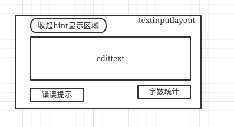

####主要的类：
TextInputLayout：继承LinearLayout，用于盛放EditText。
CollapsingTextHelper：处理hint文字收起和展开动画。
相关的类我已经从design里面抽取出来了：


- - -

####结构和使用方法
演示如下：


使用的时候是外层TextInputLayout包裹一个EditText如下：
```
    <demo.design.TextInputLayout
        android:id="@+id/inputlayout"
        android:layout_width="match_parent"
        android:layout_height="wrap_content">

        <demo.design.TextInputEditText
            android:layout_width="match_parent"
            android:layout_height="wrap_content"
            android:hint="测试文字测速古" />
    </demo.design.TextInputLayout>
```
简单的结构图如下：



####具体的源码分析
TextInputLayout里面重写了addView，初始化的时候把EditText设置进去：
```
    @Override
    public void addView(View child, int index, ViewGroup.LayoutParams params) {
        if (child instanceof EditText) {
            setEditText((EditText) child);//初始化EditText
            super.addView(child, 0, updateEditTextMargin(params));//
        } else {
            // Carry on adding the View...
            super.addView(child, index, params);
        }
    }
```

在onLayout里面初始化mCollapsingTextHelper里面做动画的两个状态区域的大小，一个是展开的，一个是收起的，因为做动画是使用文字生成bitmap后再进行缩放的。
```
    @Override
    protected void onLayout(boolean changed, int left, int top, int right, int bottom) {
        super.onLayout(changed, left, top, right, bottom);

        if (mHintEnabled && mEditText != null) {
            final int l = mEditText.getLeft() + mEditText.getCompoundPaddingLeft();
            final int r = mEditText.getRight() - mEditText.getCompoundPaddingRight();
            
            //初始化mCollapsingTextHelper里展开时的矩形区域ExpandedBounds
            mCollapsingTextHelper.setExpandedBounds(l,
                    mEditText.getTop() + mEditText.getCompoundPaddingTop(),
                    r, mEditText.getBottom() - mEditText.getCompoundPaddingBottom());

            // Set the collapsed bounds to be the the full height (minus padding) to match the
            // EditText's editable area
            //初始化mCollapsingTextHelper里收起时的矩形区域CollapsedBounds
            mCollapsingTextHelper.setCollapsedBounds(l, getPaddingTop(),
                    r, bottom - top - getPaddingBottom());

            mCollapsingTextHelper.recalculate();
        }
    }
```

在setEditText里面初始化EditText相关的东西，以及mCollapsingTextHelper动画相关的参数。
```
private void setEditText(EditText editText) {
        // If we already have an EditText, throw an exception
        if (mEditText != null) {
            throw new IllegalArgumentException("We already have an EditText, can only have one");
        }

        if (!(editText instanceof TextInputEditText)) {//建议使用TextInputEditText
            Log.i(LOG_TAG, "EditText added is not a TextInputEditText. Please switch to using that"
                    + " class instead.");
        }

        mEditText = editText;

        // Use the EditText's typeface, and it's text size for our expanded text
        mCollapsingTextHelper.setTypefaces(mEditText.getTypeface());
        mCollapsingTextHelper.setExpandedTextSize(mEditText.getTextSize());

        final int editTextGravity = mEditText.getGravity();
        mCollapsingTextHelper.setCollapsedTextGravity(
                Gravity.TOP | (editTextGravity & GravityCompat.RELATIVE_HORIZONTAL_GRAVITY_MASK));
        mCollapsingTextHelper.setExpandedTextGravity(editTextGravity);

        // Add a TextWatcher so that we know when the text input has changed
        mEditText.addTextChangedListener(new TextWatcher() {
            @Override
            public void afterTextChanged(Editable s) {
                updateLabelState(true);
                if (mCounterEnabled) {
                    updateCounter(s.length());//监听内容数量
                }
            }

            @Override
            public void beforeTextChanged(CharSequence s, int start, int count, int after) {}

            @Override
            public void onTextChanged(CharSequence s, int start, int before, int count) {}
        });

        // Use the EditText's hint colors if we don't have one set
        if (mDefaultTextColor == null) {
            mDefaultTextColor = mEditText.getHintTextColors();
        }

        // If we do not have a valid hint, try and retrieve it from the EditText, if enabled
        if (mHintEnabled && TextUtils.isEmpty(mHint)) {
            setHint(mEditText.getHint());
            // Clear the EditText's hint as we will display it ourselves
            mEditText.setHint(null);
        }

        if (mCounterView != null) {
            updateCounter(mEditText.getText().length());
        }

        if (mIndicatorArea != null) {//下面错误提示的view
            adjustIndicatorPadding();
        }

        // Update the label visibility with no animation
        updateLabelState(false);
    }
```

点击的时候hint文字会向上移动的动画，触发是在refreshDrawableState里面的updateLabelState
```
    @Override
    public void refreshDrawableState() {
        super.refreshDrawableState();
        // Drawable state has changed so see if we need to update the label
        updateLabelState(ViewCompat.isLaidOut(this));
    }
```
在updateLabelState里面，通过获取背景drawable的statelist判断当前的focus状态，通过这个状态判断是否做动画。
```
    private void updateLabelState(boolean animate) {
        final boolean hasText = mEditText != null && !TextUtils.isEmpty(mEditText.getText());
        final boolean isFocused = arrayContains(getDrawableState(), android.R.attr.state_focused);
        final boolean isErrorShowing = !TextUtils.isEmpty(getError());

        if (mDefaultTextColor != null) {
            mCollapsingTextHelper.setExpandedTextColor(mDefaultTextColor.getDefaultColor());
        }

        if (mCounterOverflowed && mCounterView != null) {
            mCollapsingTextHelper.setCollapsedTextColor(mCounterView.getCurrentTextColor());
        } else if (isFocused && mFocusedTextColor != null) {
            mCollapsingTextHelper.setCollapsedTextColor(mFocusedTextColor.getDefaultColor());
        } else if (mDefaultTextColor != null) {
            mCollapsingTextHelper.setCollapsedTextColor(mDefaultTextColor.getDefaultColor());
        }

        if (hasText || isFocused || isErrorShowing) {
            // We should be showing the label so do so if it isn't already
            collapseHint(animate);//收起动画
        } else {
            // We should not be showing the label so hide it
            expandHint(animate);//展开动画
        }
    }
```
动画实现的流程如下图：


collapseHint和expandHint基本上是一样的，只是最终的状态不一样，如果没有动画就直接调用mCollapsingTextHelper.setExpansionFraction()方法设置好最终状态；如果有动画，也是通过这个方法设置，只是在UpdateListener里面通过获取动画进行的百分比再设置对应的位置。

```
    private void collapseHint(boolean animate) {
        if (mAnimator != null && mAnimator.isRunning()) {
            mAnimator.cancel();
        }
        if (animate && mHintAnimationEnabled) {
            animateToExpansionFraction(1f);
        } else {
            mCollapsingTextHelper.setExpansionFraction(1f);
        }
    }

    private void expandHint(boolean animate) {
        if (mAnimator != null && mAnimator.isRunning()) {
            mAnimator.cancel();
        }
        if (animate && mHintAnimationEnabled) {
            animateToExpansionFraction(0f);
        } else {
            mCollapsingTextHelper.setExpansionFraction(0f);
        }
    }

    private void animateToExpansionFraction(final float target) {
        if (mCollapsingTextHelper.getExpansionFraction() == target) {
            return;
        }
        if (mAnimator == null) {
            mAnimator = ViewUtils.createAnimator();
            mAnimator.setInterpolator(AnimationUtils.LINEAR_INTERPOLATOR);
            mAnimator.setDuration(ANIMATION_DURATION);
            mAnimator.setUpdateListener(new ValueAnimatorCompat.AnimatorUpdateListener() {
                @Override
                public void onAnimationUpdate(ValueAnimatorCompat animator) {
                    mCollapsingTextHelper.setExpansionFraction(animator.getAnimatedFloatValue());
                }
            });
        }
        mAnimator.setFloatValues(mCollapsingTextHelper.getExpansionFraction(), target);
        mAnimator.start();
    }
```
对于动画的实现过程： setExpansionFraction->calculateCurrentOffsets->calculateOffsets 
函数calculateOffsets通过传入的fraction计算当前画笔的textsize，color，ShadowLayer等参数。

```
private void calculateOffsets(final float fraction) {
        interpolateBounds(fraction);
        mCurrentDrawX = lerp(mExpandedDrawX, mCollapsedDrawX, fraction,
                mPositionInterpolator);
        mCurrentDrawY = lerp(mExpandedDrawY, mCollapsedDrawY, fraction,
                mPositionInterpolator);

        setInterpolatedTextSize(lerp(mExpandedTextSize, mCollapsedTextSize,
                fraction, mTextSizeInterpolator));

        if (mCollapsedTextColor != mExpandedTextColor) {
            // If the collapsed and expanded text colors are different, blend them based on the
            // fraction
            mTextPaint.setColor(blendColors(mExpandedTextColor, mCollapsedTextColor, fraction));
        } else {
            mTextPaint.setColor(mCollapsedTextColor);
        }

        mTextPaint.setShadowLayer(
                lerp(mExpandedShadowRadius, mCollapsedShadowRadius, fraction, null),
                lerp(mExpandedShadowDx, mCollapsedShadowDx, fraction, null),
                lerp(mExpandedShadowDy, mCollapsedShadowDy, fraction, null),
                blendColors(mExpandedShadowColor, mCollapsedShadowColor, fraction));

        ViewCompat.postInvalidateOnAnimation(mView);
    }
```

上面计算颜色使用的是这个函数，可以用来做两个颜色之间的渐变，对A,R,G,B分别做处理，原生系统也有这个ArgbEvaluator，实现基本是一样的。

```
    private static int blendColors(int color1, int color2, float ratio) {
        final float inverseRatio = 1f - ratio;
        float a = (Color.alpha(color1) * inverseRatio) + (Color.alpha(color2) * ratio);
        float r = (Color.red(color1) * inverseRatio) + (Color.red(color2) * ratio);
        float g = (Color.green(color1) * inverseRatio) + (Color.green(color2) * ratio);
        float b = (Color.blue(color1) * inverseRatio) + (Color.blue(color2) * ratio);
        return Color.argb((int) a, (int) r, (int) g, (int) b);
    }
```

动画过程是在draw里面实现的，绘制分两种情况 ：1、hint文字收起和展开的文字大小差不多，即缩放比例为1，使用mTextPaint绘制文字即可。2、缩放的比例不为1，则需要把hint文字生成bitmap再通过改变bitmap的区域大小进行缩放。：

```
public void draw(Canvas canvas) {
        final int saveCount = canvas.save();

        if (mTextToDraw != null && mDrawTitle) {
            float x = mCurrentDrawX;
            float y = mCurrentDrawY;
            //是否使用Texture，其实是使用bitmap
            final boolean drawTexture = mUseTexture && mExpandedTitleTexture != null;

            final float ascent;
            final float descent;
            if (drawTexture) {
                ascent = mTextureAscent * mScale;
                descent = mTextureDescent * mScale;
            } else {
                ascent = mTextPaint.ascent() * mScale;
                descent = mTextPaint.descent() * mScale;
            }

            if (DEBUG_DRAW) {//debug打开后可以很明显地看到绘制的区域
                // Just a debug tool, which drawn a Magneta rect in the text bounds
                canvas.drawRect(mCurrentBounds.left, y + ascent, mCurrentBounds.right, y + descent,
                        DEBUG_DRAW_PAINT);
            }

            if (drawTexture) {
                y += ascent;
            }

            if (mScale != 1f) {
                canvas.scale(mScale, mScale, x, y);
            }

            if (drawTexture) {
                // If we should use a texture, draw it instead of text
                canvas.drawBitmap(mExpandedTitleTexture, x, y, mTexturePaint);
            } else {
                canvas.drawText(mTextToDraw, 0, mTextToDraw.length(), x, y, mTextPaint);
            }
        }

        canvas.restoreToCount(saveCount);
    }
```

####总结
TextInputLayout是一个比较简单的库，不过动画的部分实现的比较复杂，优点也是有很多的，不过还是发现了一部分的缺点 ：)。

缺点：

1、无法设置/获取上面文字的颜色，大小，间距等，下面的错误提示内容也是一样无法设置。

2、无法设置动画时间，在代码里写死了。

3、显示错误提示后高度会变化。

4、显示文字个数会，超出后闪退。

5、如果包含的edittext有android:layout_marginLeft="10dp" ，这样布局有问题，这个修改有做备注。
